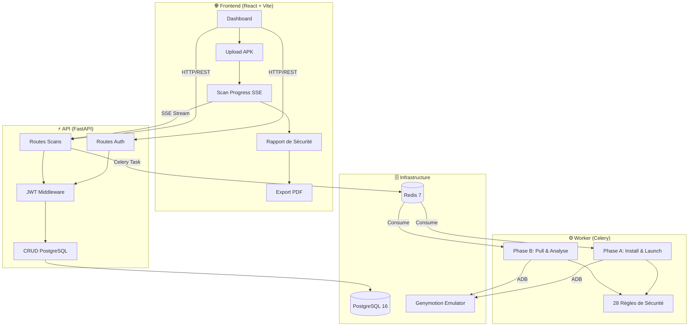
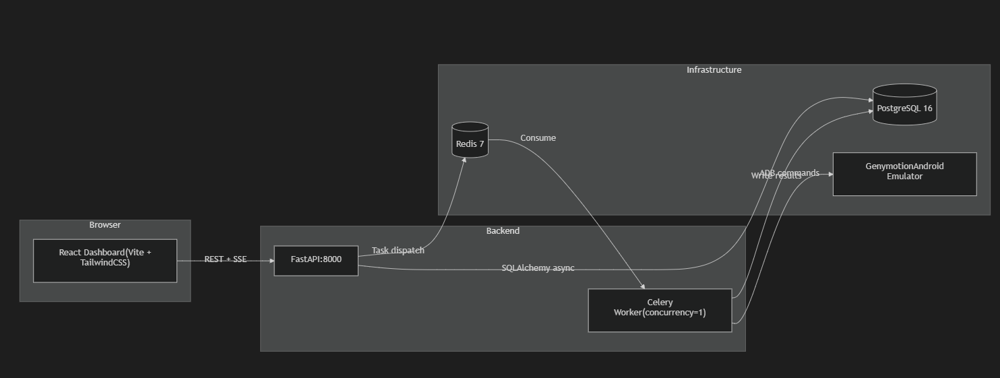

<div align="center">

# 🛡️ SecureStorageInspector (VaultDex)

**Scanner de sécurité automatisé pour applications Android (APK)**

Analysez le stockage local des applications Android pour détecter les vulnérabilités :
mots de passe en clair, tokens API exposés, bases de données non chiffrées, et bien plus.

[](LICENSE)
[](https://python.org)
[](https://react.dev)
[](https://fastapi.tiangolo.com)

</div>

---

## 📺 Démo Vidéo

<div align="center">

[](https://youtu.be/i3LqUeckQQ4)

▶️ **[https://youtu.be/i3LqUeckQQ4](https://youtu.be/i3LqUeckQQ4)**

</div>

---

## 📖 Description du Projet

**SecureStorageInspector** est un outil de sécurité complet qui automatise l'audit du stockage local des applications Android. Il installe un fichier APK sur un émulateur Android (Genymotion), permet à l'utilisateur d'interagir manuellement avec l'application, puis extrait et analyse toutes les données stockées localement pour identifier les vulnérabilités de sécurité.

### Fonctionnalités principales

- 🔍 **Analyse statique** — Extraction des permissions, composants exportés, drapeaux de sécurité du manifest
- 📱 **Analyse dynamique** — Installation sur émulateur + interaction manuelle utilisateur
- 🗄️ **Inspection du stockage** — SharedPreferences, bases SQLite, fichiers, cache
- 🔐 **28 règles de sécurité** — Détection de credentials, PII, crypto faible, tokens API
- 📊 **Score de risque** — Note de 0 à 100 avec répartition par sévérité (CRITICAL/HIGH/MEDIUM/LOW)
- 📄 **Export PDF** — Rapport complet généré côté client avec jsPDF
- 🔑 **Authentification JWT** — Multi-utilisateur avec isolation des données par tenant
- 📈 **Dashboard temps réel** — Statistiques, historique des scans, notifications

---

## 🏗️ Architecture du Projet

```
apk-scanner/
│
├── 📁 backend/                          # Backend Python (FastAPI + Celery)
│   ├── __init__.py
│   ├── config.py                        # Configuration centralisée (pydantic-settings)
│   │
│   ├── 📁 adb/                          # Contrôleur ADB (Android Debug Bridge)
│   │   ├── __init__.py
│   │   ├── adb_controller.py            # Commandes ADB : install, pull, launch, screenshot
│   │   └── utils.py                     # Utilitaires : création répertoires, zip des dumps
│   │
│   ├── 📁 api/                          # API REST (FastAPI)
│   │   ├── __init__.py
│   │   ├── app.py                       # Factory FastAPI + lifespan (création tables DB)
│   │   ├── auth.py                      # JWT : hash bcrypt, création/validation tokens
│   │   ├── dependencies.py              # Injection de dépendances (session DB)
│   │   ├── middleware.py                # CORS, rate-limiting (slowapi), headers sécurité
│   │   ├── schemas.py                   # Schémas Pydantic (requêtes/réponses)
│   │   └── 📁 routes/
│   │       ├── __init__.py
│   │       ├── auth.py                  # POST /register, POST /login, GET /me
│   │       ├── health.py                # GET /health (healthcheck)
│   │       └── scans.py                 # CRUD scans + SSE progress + report + finalize
│   │
│   ├── 📁 db/                           # Couche base de données (SQLAlchemy async)
│   │   ├── __init__.py
│   │   ├── database.py                  # Engine async PostgreSQL + session factory
│   │   ├── models.py                    # Modèles ORM : User, Scan
│   │   └── crud.py                      # Opérations CRUD (create, get, list, stats, delete)
│   │
│   ├── 📁 emulator/                     # Contrôleur Genymotion
│   │   ├── __init__.py
│   │   └── genymotion_controller.py     # Reset snapshot, démarrage VM, attente boot
│   │
│   ├── 📁 engine/                       # Moteur d'analyse de sécurité
│   │   ├── __init__.py
│   │   ├── analyser.py                  # AnalysisEngine : orchestre tous les analyseurs
│   │   ├── models.py                    # Modèles Pydantic : SecurityReport, Finding, etc.
│   │   ├── scoring.py                   # Algorithme de scoring (0–100)
│   │   ├── rules_engine.py              # Moteur de règles (pattern matching)
│   │   ├── 📁 analysers/
│   │   │   ├── __init__.py
│   │   │   ├── static_analyser.py       # Analyse du manifest APK (aapt2)
│   │   │   ├── sharedprefs_analyser.py  # Analyse SharedPreferences XML
│   │   │   ├── database_analyser.py     # Analyse bases SQLite
│   │   │   ├── file_analyser.py         # Analyse fichiers génériques
│   │   │   └── cache_analyser.py        # Analyse du cache applicatif
│   │   └── 📁 rules/
│   │       ├── __init__.py
│   │       ├── credential_rules.py      # Règles : mots de passe, tokens, API keys
│   │       ├── pii_rules.py             # Règles : données personnelles (email, phone, etc.)
│   │       ├── crypto_rules.py          # Règles : crypto faible, clés en clair
│   │       └── config_rules.py          # Règles : configurations dangereuses
│   │
│   └── 📁 worker/                       # Worker Celery (tâches asynchrones)
│       ├── __init__.py
│       ├── celery_app.py                # Configuration Celery + broker Redis
│       ├── tasks.py                     # Tâches : run_scan_task, finalize_scan_task
│       └── scan_pipeline.py             # Pipeline en 2 phases (Phase A + Phase B)
│
├── 📁 frontend/                         # Frontend React (Vite + TypeScript + TailwindCSS)
│   ├── index.html                       # Point d'entrée HTML
│   ├── package.json                     # Dépendances npm
│   ├── vite.config.ts                   # Configuration Vite
│   ├── tsconfig.json                    # Configuration TypeScript
│   └── 📁 src/
│       ├── main.tsx                     # Bootstrap React + Router
│       ├── App.tsx                      # Routes protégées + layout principal
│       ├── index.css                    # Styles globaux (TailwindCSS v4)
│       ├── 📁 api/
│       │   └── client.ts               # Client Axios + intercepteurs JWT + types API
│       ├── 📁 context/
│       │   └── AuthContext.tsx          # Provider d'authentification React
│       └── 📁 pages/
│           ├── HomePage.tsx             # Dashboard : stats, upload APK, scans récents
│           ├── LoginPage.tsx            # Page de connexion
│           ├── RegisterPage.tsx         # Page d'inscription
│           ├── ScanProgressPage.tsx     # Progression temps réel (SSE EventSource)
│           ├── ReportPage.tsx           # Rapport de sécurité complet + export PDF
│           └── HistoryPage.tsx          # Historique des scans avec recherche
│
├── 📁 uploads/                          # APK uploadés (noms UUID, nettoyés après scan)
├── 📁 dumps/                            # Dumps ADB extraits de l'émulateur
├── 📁 reports/                          # Rapports JSON générés
│
├── docker-compose.yml                   # Services Docker : PostgreSQL 16 + Redis 7
├── requirements.txt                     # Dépendances Python
├── .env                                 # Variables d'environnement (non versionné)
├── .env.example                         # Template des variables d'environnement
├── LICENSE                              # Licence MIT
└── README.md                            # Ce fichier
```

---

## 🔄 Architecture Logicielle


### Architecture System


### Flux de scan en deux phases

| Phase | Étapes | Description |
|-------|--------|-------------|
| **Phase A** | INIT → STATIC → RESET → BOOT → INSTALL → LAUNCH → WAITING | Installe l'APK et lance l'app. L'utilisateur interagit manuellement. |
| **Phase B** | PULL → CLEANUP → ZIP → ANALYSE → REPORT | Extrait le stockage, exécute les 28 règles, calcule le score, génère le rapport. |

---

## 🚀 Prérequis

| Composant | Version | Utilisation |
|-----------|---------|-------------|
| **Python** | 3.13+ | Backend API + Worker |
| **Node.js** | 20+ | Frontend React |
| **Docker** | 24+ | PostgreSQL + Redis |
| **Genymotion** | Desktop 3.x | Émulateur Android |
| **Android SDK** | build-tools 34+ | aapt2 (extraction manifest) |
| **ADB** | Inclus dans le repo | Communication avec l'émulateur |

---

## ⚙️ Installation & Déploiement

### 1. Cloner le dépôt

```bash
git clone https://github.com/votre-utilisateur/apk-scanner.git
cd apk-scanner
```

### 2. Configurer les variables d'environnement

```bash
cp .env.example .env
# Éditez .env avec vos chemins locaux (ADB, Genymotion, AAPT, etc.)
```

### 3. Lancer les services Docker (PostgreSQL + Redis)

```bash
docker-compose up -d
```

Vérifiez que les conteneurs sont en cours d'exécution :

```bash
docker ps
# Vous devriez voir : apk_scanner_db (PostgreSQL) et apk_scanner_redis (Redis)
```

### 4. Installer les dépendances Python

```bash
python -m venv .venv
source .venv/bin/activate          # Linux/WSL
# .venv\Scripts\activate           # Windows PowerShell

pip install -r requirements.txt
pip install python-jose[cryptography] passlib[bcrypt] bcrypt<4.0.0
```

### 5. Installer les dépendances Frontend

```bash
cd frontend
npm install
cd ..
```

### 6. Préparer l'émulateur Genymotion

1. Lancez Genymotion Desktop
2. Démarrez votre machine virtuelle Android (ex: Google Nexus 5)
3. Vérifiez la connectivité ADB :
   ```bash
   /chemin/vers/adb.exe devices
   # Devrait afficher : 192.168.56.101:5555    device
   ```

---

## 🖥️ Lancement du Projet

Ouvrez **4 terminaux** distincts et exécutez dans l'ordre :

### Terminal 1 — Services Docker

```bash
docker-compose up -d
```

### Terminal 2 — Backend API (FastAPI)

```bash
cd /chemin/vers/apk-scanner
source .venv/bin/activate
uvicorn backend.api.app:app --host 127.0.0.1 --port 8000 --reload
```

### Terminal 3 — Worker Celery

```bash
cd /chemin/vers/apk-scanner
source .venv/bin/activate
celery -A backend.worker.celery_app worker --loglevel=info --concurrency=1
```

### Terminal 4 — Frontend React

```bash
cd /chemin/vers/apk-scanner/frontend
npm run dev
```

### Accéder à l'application

| Service | URL |
|---------|-----|
| 🌐 **Dashboard React** | [http://localhost:5173](http://localhost:5173) |
| 📡 **API FastAPI** | [http://127.0.0.1:8000](http://127.0.0.1:8000) |
| 📚 **Documentation Swagger** | [http://127.0.0.1:8000/docs](http://127.0.0.1:8000/docs) |
| 📖 **Documentation ReDoc** | [http://127.0.0.1:8000/redoc](http://127.0.0.1:8000/redoc) |

---

## 🐳 Déploiement Docker

Les services d'infrastructure (PostgreSQL et Redis) sont entièrement conteneurisés via Docker Compose :

```yaml
# docker-compose.yml
services:
  postgres:
    image: postgres:16-alpine
    ports: ["127.0.0.1:5432:5432"]
    environment:
      POSTGRES_USER: scanner
      POSTGRES_PASSWORD: scanner_dev_password
      POSTGRES_DB: apk_scanner
    volumes: [pgdata:/var/lib/postgresql/data]

  redis:
    image: redis:7-alpine
    ports: ["127.0.0.1:6379:6379"]
    command: redis-server --appendonly yes
    volumes: [redisdata:/data]
```

### Commandes utiles

```bash
# Démarrer les services
docker-compose up -d

# Voir les logs
docker-compose logs -f

# Arrêter les services
docker-compose down

# Supprimer les volumes (reset complet de la DB)
docker-compose down -v
```

> **Note :** Les ports sont bindés sur `127.0.0.1` uniquement (non exposés sur le réseau) pour des raisons de sécurité.

---

## 🔒 Sécurité

| Mesure | Détail |
|--------|--------|
| **Authentification** | JWT avec bcrypt (expiration 7 jours) |
| **Isolation données** | Chaque utilisateur ne voit que ses propres scans (`owner_id`) |
| **Upload sécurisé** | Validation extension + magic bytes + taille max (100 MB) |
| **Noms de fichiers** | UUID aléatoires (pas de path traversal) |
| **Rate limiting** | 5 uploads/minute par IP (slowapi) |
| **Headers sécurité** | X-Content-Type-Options, X-Frame-Options, CSP |
| **CORS** | Origines autorisées configurables |
| **Parsing XML** | `defusedxml` contre les attaques XXE |

---

## 🧪 Tests

```bash
source .venv/bin/activate

# Tests unitaires du moteur d'analyse
python -m pytest test_engine.py -v

# Tests de la Phase 1 (pipeline ADB)
python -m pytest test_phase1.py -v
```

---

## 📚 Stack Technique

### Backend
- **FastAPI** — Framework web async haute performance
- **SQLAlchemy 2.0** — ORM async avec asyncpg
- **Celery** — File de tâches distribuées
- **Redis** — Broker de messages Celery
- **PostgreSQL 16** — Base de données relationnelle
- **Pydantic v2** — Validation de données et sérialisation
- **python-jose** — Gestion des tokens JWT
- **passlib + bcrypt** — Hachage sécurisé des mots de passe

### Frontend
- **React 19** — Bibliothèque UI
- **TypeScript** — Typage statique
- **Vite 8** — Bundler ultra-rapide
- **TailwindCSS v4** — Framework CSS utilitaire
- **Recharts** — Graphiques interactifs
- **Framer Motion** — Animations fluides
- **jsPDF** — Génération PDF côté client
- **Axios** — Client HTTP avec intercepteurs JWT
- **Lucide React** — Icônes SVG

### Infrastructure
- **Docker Compose** — Orchestration des conteneurs
- **Genymotion** — Émulateur Android
- **ADB** — Android Debug Bridge

---

## 📝 Licence

Ce projet est distribué sous la **Licence MIT**. Voir le fichier [LICENSE](LICENSE) pour plus de détails.

```
MIT License

Copyright (c) 2026 VaultDex

Permission is hereby granted, free of charge, to any person obtaining a copy
of this software and associated documentation files (the "Software"), to deal
in the Software without restriction, including without limitation the rights
to use, copy, modify, merge, publish, distribute, sublicense, and/or sell
copies of the Software, and to permit persons to whom the Software is
furnished to do so, subject to the following conditions:

The above copyright notice and this permission notice shall be included in all
copies or substantial portions of the Software.

THE SOFTWARE IS PROVIDED "AS IS", WITHOUT WARRANTY OF ANY KIND, EXPRESS OR
IMPLIED, INCLUDING BUT NOT LIMITED TO THE WARRANTIES OF MERCHANTABILITY,
FITNESS FOR A PARTICULAR PURPOSE AND NONINFRINGEMENT. IN NO EVENT SHALL THE
AUTHORS OR COPYRIGHT HOLDERS BE LIABLE FOR ANY CLAIM, DAMAGES OR OTHER
LIABILITY, WHETHER IN AN ACTION OF CONTRACT, TORT OR OTHERWISE, ARISING FROM,
OUT OF OR IN CONNECTION WITH THE SOFTWARE OR THE USE OR OTHER DEALINGS IN THE
SOFTWARE.
```

---

<div align="center">

**Fait avec ❤️ par l'équipe VaultDex**

</div>
